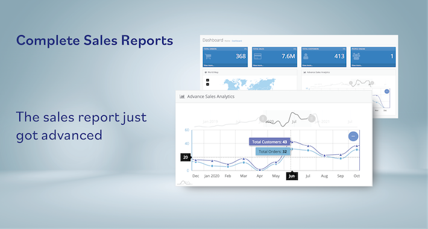
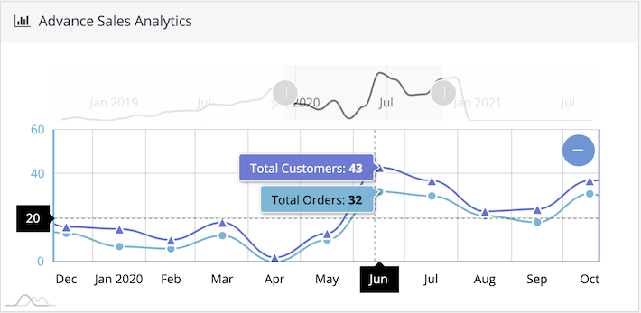
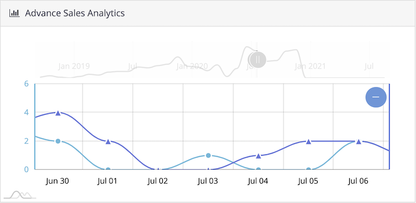
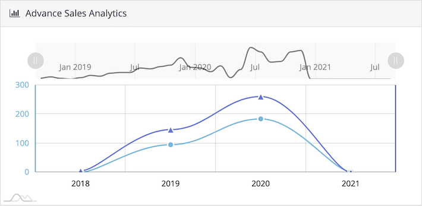
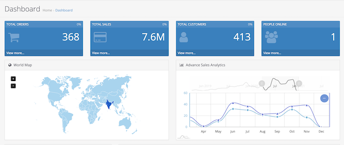
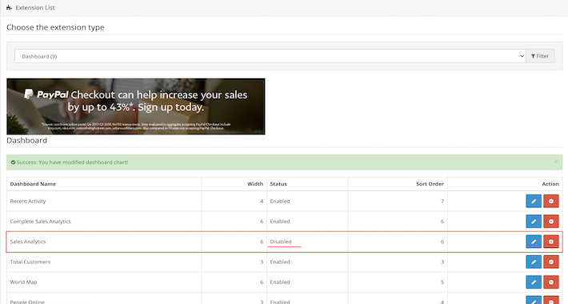
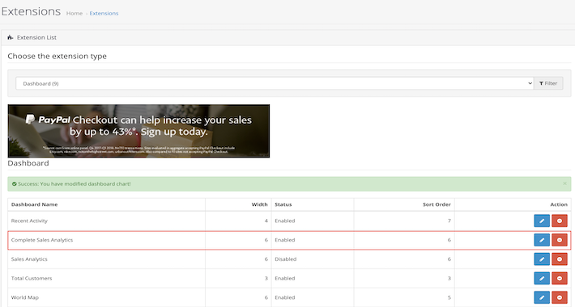
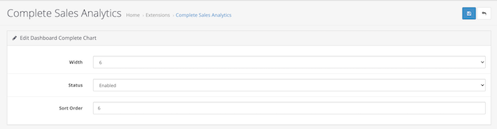

# CompleteSalesReport-Opencart
It is a simple extension that allows you to view a complete report/data of customers/orders at once. you can view your data year-wise, month-wise, or even day-wise. You can also change the date range.

OpenCart Marketplace link: https://www.opencart.com/index.php?route=marketplace/extension/info&extension_id=42435

###### It does not modify any core file.

## Installation:
1) Log in to your OpenCart admin panel. Once you do that, go to Extensions -> Extension Installer.
2) Click on the Upload button.
3) Find complete-sales-report-on-dashboard.ocmod.zip on the folder and load it.
4) OpenCart will begin the installation of the module along with the OCMod and when the operation is done you will receive the following message - Success: You have installed your extension!
5) Now, go to Extensions -> Extensions, select dashboard
6) Disable Sales Analytics.
7) Edit and Enable Complete Sales Analytics Extension.
8) Note: Set width to 6 and sort order to 6 for accurate format on dashboard

